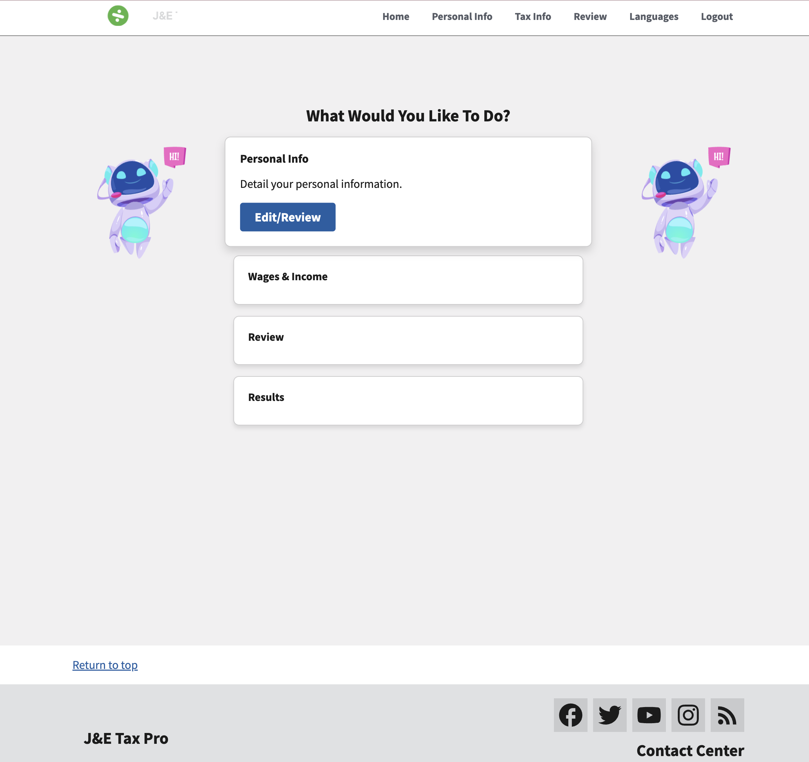
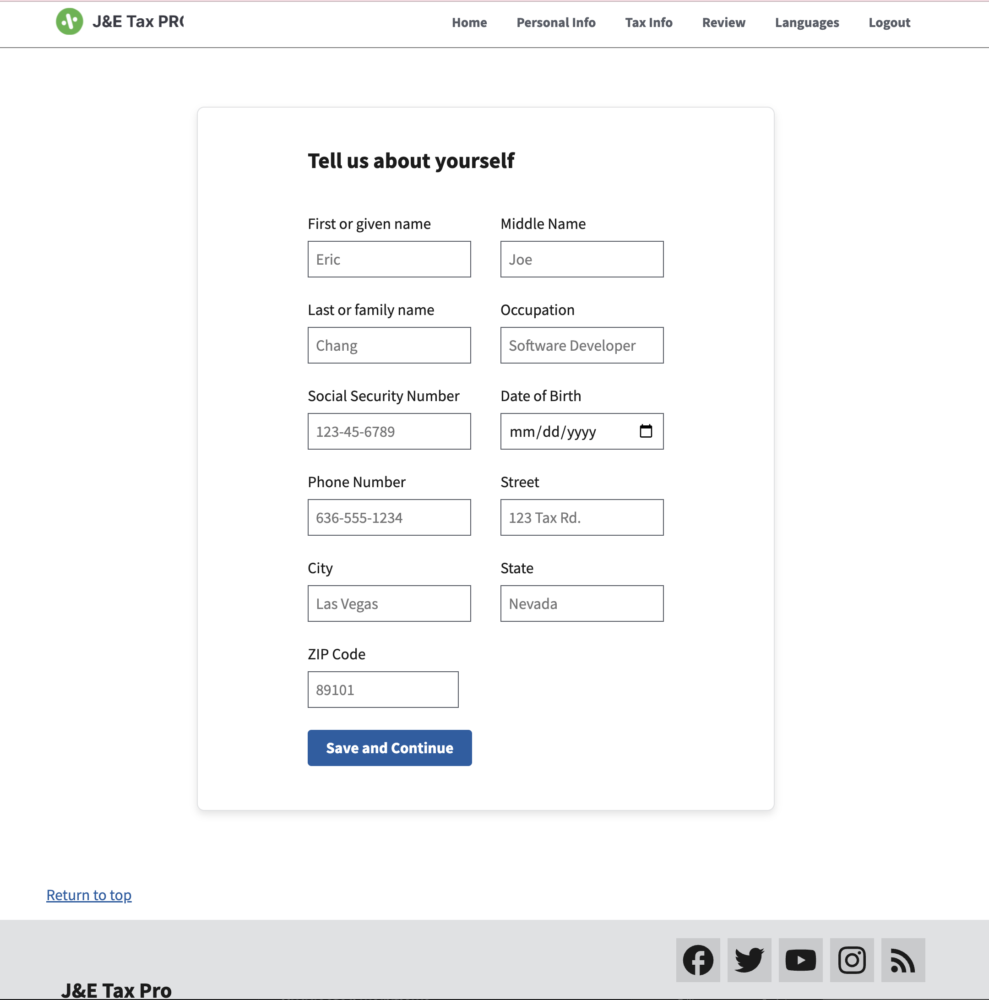
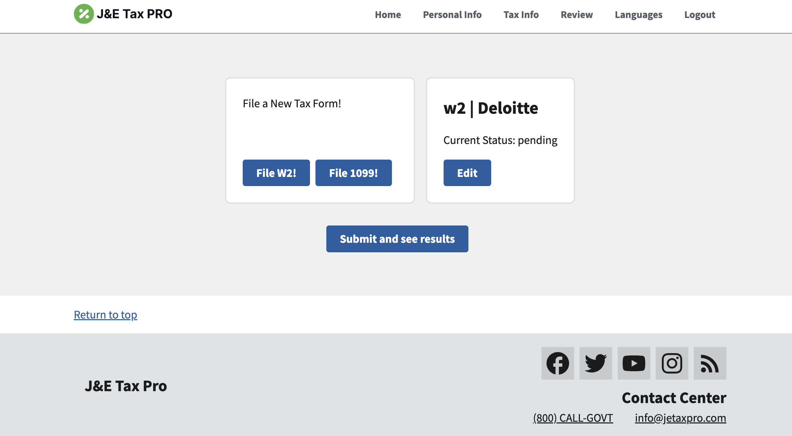
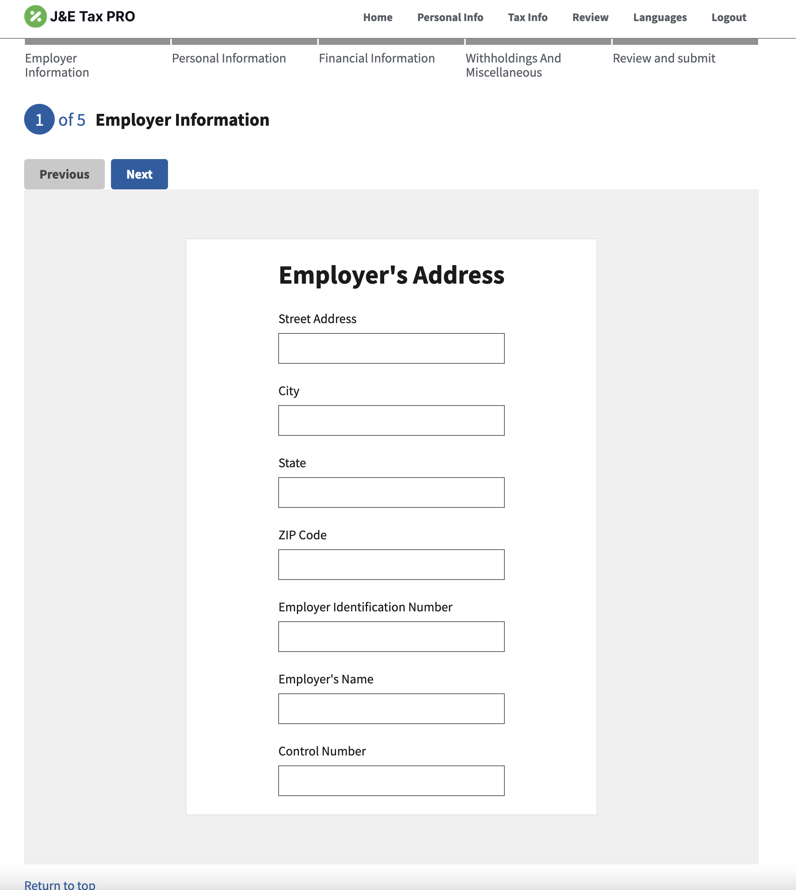

# J-E TAX PRO
Table of Contents
- [Description](#description)
- [Author](#author)
- [Built With](#built-with)
- [Project Overview & Demos](#project-overview--demos)

 ## Description
This repository contains the front-end code for our tax filing application, which provides a user-friendly interface for individuals to file their taxes online. The application guides users through the process of entering their personal and financial information, reviewing their tax forms, and submitting them for processing.

## Author

- [**Eric Chang**](https://github.com/ESC8504)
- [**Joseph Sam**](https://github.com/Joseph-Jay-Sam)

## Built With

## Project Overview & Demos

  
   
   
   
   
   
   

